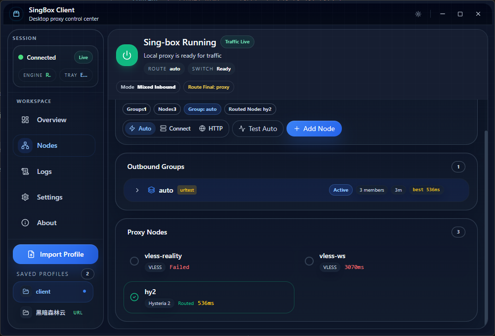

# SingBox Client

A lightweight Windows GUI client for [sing-box](https://sing-box.sagernet.org/), built with Tauri 2, React, and TypeScript.

## Interface Snapshot



The main workspace is optimized for a small desktop window:

- top bar for runtime status, current route, and quick start/stop
- `Nodes` page for outbound group selection, node latency testing, and node editing
- left sidebar for profile import and switching between saved local/URL profiles

## Features

- Import sing-box JSON profiles with compatibility cleanup for sing-box `1.12.x`
- Import from either local JSON or subscription URL through a unified import modal
- Validate profiles before import: node/group count, TUN detection, compatibility warnings
- Auto-extract proxy nodes and outbound groups from imported configs
- Select groups or nodes from both the `Nodes` page and the `Overview` page
- Refresh saved URL-based profiles without re-pasting the subscription link
- Start sing-box with elevation only when the active config contains `tun` inbound
- Run a startup health check before launch: core path, runtime config, mixed port, TUN requirement
- Auto-inject a local `mixed` inbound fallback when needed
- Manage Windows system proxy state and restore the previous proxy state on stop/exit
- Test node latency from the client
- Edit single nodes, route rules, DNS settings, TUN settings, and rule sets
- View runtime logs inside the client
- Light/dark desktop UI with custom titlebar and tray integration

## Architecture

```text
SingBox/
|-- src/                    # React frontend
|   |-- components/         # UI components
|   |-- hooks/              # App state and actions
|   `-- types/              # TypeScript interfaces
|-- src-tauri/              # Rust backend
|   `-- src/
|       `-- commands/       # IPC commands (config, singbox, proxy, latency)
|-- bin/                    # sing-box.exe
`-- package.json
```

## Tech Stack

- Frontend: React 18, TypeScript, Tailwind CSS, Lucide Icons
- Backend: Rust, Tauri 2
- Proxy Core: sing-box
- Build: Vite, Cargo

## Prerequisites

- Node.js `>= 18`
- Rust stable toolchain
- Windows 10/11 with WebView2 runtime
- `sing-box.exe` available in `bin/` or otherwise discoverable by the app

## Development

```bash
npm install
npm run tauri dev
npm run tauri build
```

## Portable Distribution

If you do not want to ship an installer, you can ship a portable zip plus a PowerShell install script.

1. Build the desktop app:

```bash
npm run tauri build
```

2. Package the portable bundle:

```bash
npm run package:portable
```

3. Distribute the generated zip:

```text
src-tauri/target/release/bundle/portable/SingBox-Client_1.3.1_x64-portable.zip
```

4. On the target machine, unzip it and run:

```powershell
powershell -ExecutionPolicy Bypass -File .\install.ps1
```

This installs the app into `%LOCALAPPDATA%\Programs\SingBox Client`, copies the bundled `bin/` runtime files, creates shortcuts, and launches the client. A separate sing-box installation is not required.

## Usage

1. Launch the application.
2. Click `Import Profile`.
3. Choose either `Local JSON` or `Subscription URL`.
4. Review the import preflight result before confirming the import.
5. Nodes and groups are extracted and shown in the UI.
6. Click `Start` to launch sing-box.
7. The client runs a startup health check before starting the core.
8. If the active config contains a `tun` inbound, Windows will show a `UAC` prompt.
9. Click `Stop` to terminate sing-box and restore the previous Windows proxy state.

## Saved Profiles

- Imported profiles are stored locally in the client profile store
- `Local` profiles come from JSON files you picked in Explorer
- `URL` profiles come from subscription links and can be refreshed in-place from the sidebar
- Only `http://` and `https://` sources are treated as URL profiles; Windows file paths are always treated as local files
- Editing a saved profile updates the stored JSON and, if active, immediately refreshes the runtime config
- Importing a new profile does not clear existing saved profiles

## Import Profile Requirements

The imported file must be a valid sing-box JSON config. The client works best when the file follows the usual sing-box structure:

- `outbounds` should exist and include real proxy outbounds such as `vless`, `vmess`, `trojan`, `shadowsocks`, `hysteria2`, `tuic`, or `wireguard`
- outbound groups should use `type: "selector"` or `type: "urltest"`
- each group member listed in `outbounds[].outbounds` should match an existing outbound `tag`
- if you want stable selection behavior, every node and group should have a unique `tag`
- `inbounds` is optional because the client can inject a fallback `mixed` inbound
- `dns` and `route` are optional, but if present they must already be valid sing-box sections

### Minimal Recommended Sample

```json
{
  "inbounds": [
    {
      "type": "mixed",
      "tag": "mixed-in",
      "listen": "127.0.0.1",
      "listen_port": 7890
    }
  ],
  "outbounds": [
    {
      "type": "vless",
      "tag": "node-a",
      "server": "example.com",
      "server_port": 443,
      "uuid": "00000000-0000-0000-0000-000000000000",
      "tls": {
        "enabled": true,
        "server_name": "example.com"
      }
    },
    {
      "type": "selector",
      "tag": "proxy",
      "outbounds": ["node-a"],
      "default": "node-a"
    },
    {
      "type": "direct",
      "tag": "direct"
    },
    {
      "type": "block",
      "tag": "block"
    }
  ],
  "route": {
    "final": "proxy"
  }
}
```

### Import Notes

- If the profile contains `tun` inbound, startup will require elevation.
- If no `mixed` inbound exists, the client will add one for local proxy mode.
- The import modal performs a lightweight preflight check before saving the profile.
- URL profiles can be refreshed later from `Saved Profiles`.
- Imported profiles are saved into the client profile store. Importing a new file does not clear existing saved profiles.
- Group selection works best when selector and urltest groups already have correct `default` and `outbounds` relationships.

### Import Preflight Currently Checks

- Whether the content can be parsed as sing-box JSON or base64-encoded sing-box JSON
- Whether proxy nodes can be extracted
- Whether selector/urltest groups can be extracted
- Whether a TUN inbound is present
- Whether the profile is likely to need extra attention before startup

### Quick Import Checklist

- The JSON parses successfully.
- Each real proxy outbound has required protocol-specific fields.
- Every selector or urltest member tag points to an existing outbound.
- `route.final` ultimately points to a valid group or node.
- If using Reality, TLS, TUIC, or Hysteria2, those protocol fields already match your sing-box version.

## Supported Protocols

- VLESS
- VMess
- Shadowsocks
- Trojan
- Hysteria2
- TUIC
- WireGuard

## Config Compatibility

The client automatically normalizes some older config details for sing-box `1.12.x`:

- Moves per-server `strategy` into the DNS top-level when needed
- Removes deprecated DNS servers with `type: "block"`
- Migrates legacy `ssl` blocks to `tls` when `tls` is missing
- Merges legacy TUN `inet4_*` and `inet6_*` address fields into the current array-based fields
- Removes `sniff_override_destination` from route rule sniff actions when required
- Adds a local `mixed` inbound on port `7890` if not present

The client also injects the required `ENABLE_DEPRECATED_*` compatibility environment variables only into the spawned `sing-box` process. Users do not need to configure system-wide environment variables manually.

## Current Limitations

- `Check for Updates` in the `About` page is informational only; no updater backend is wired yet
- Runtime logs depend on what sing-box writes to stdout/stderr
- Startup health check is intentionally lightweight; it catches common local issues, not every protocol-level failure

## Troubleshooting

### Start fails before the core launches

Check the startup health badges in the header. The client now pre-checks:

- bundled `sing-box.exe` availability
- runtime config presence
- mixed inbound port availability
- whether the active profile requires TUN/UAC elevation

### URL profile imports but later becomes stale

Use the refresh action in `Saved Profiles`. Only URL-based profiles expose refresh because the original source can be fetched again.

### A profile imports but still cannot connect

Import validation only checks structure and common compatibility problems. It does not guarantee the remote server, credentials, Reality keys, TLS fields, or protocol-specific values are correct.

## UI Direction

The desktop UI is intentionally optimized for a small default window:

- one primary import action instead of separate stacked file/URL panels
- compact health/status chips instead of large diagnostic cards
- source-aware saved profiles with direct refresh/edit/delete actions
- small-screen-safe sidebar behavior so saved profiles remain reachable in short window heights

## License

MIT
